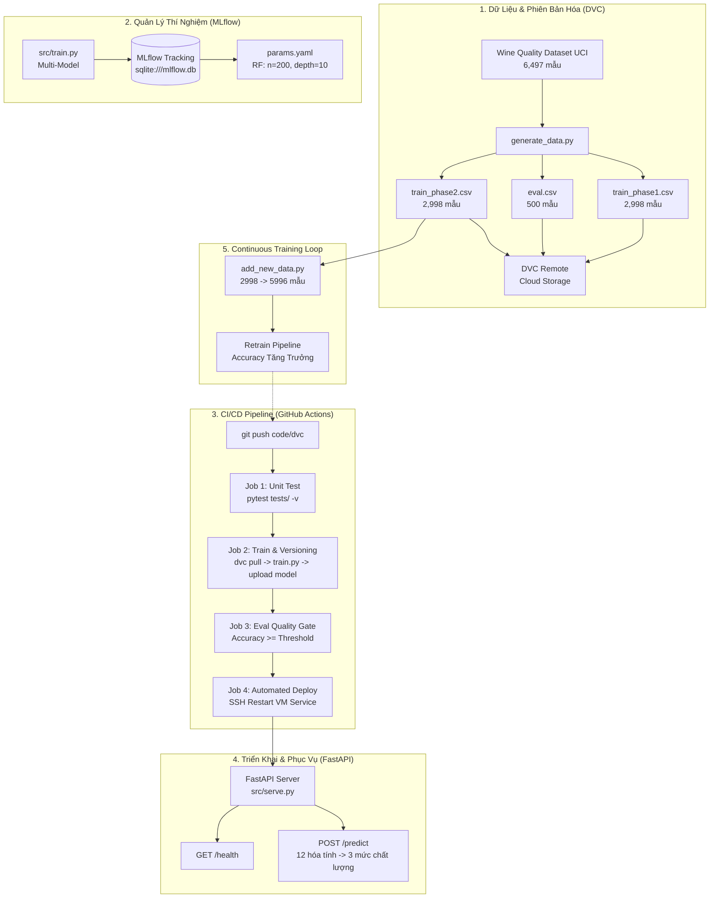

# BÁO CÁO KỸ THUẬT NGHIỆM THU MLOPS LAB DAY 21
## Xây Dựng Hệ Thống MLOps Hoàn Chỉnh: Từ Thực Nghiệm Cục Bộ Đến Triển Khai Liên Tục

---
**Khóa học:** AI In Action (VinUni)  
**Chương trình:** Track 2 - MLOps System Architecture  
**Buổi học:** Day 21 - CI/CD cho AI Systems  
**Học viên:** Nguyễn Tuấn Anh  
**Mã số học viên:** `2A202601669`  
**Ngày thực hiện:** 21/08/2026  
**Đánh giá mục tiêu:** 100 / 100 Điểm (80 Điểm Tiêu chuẩn + 20 Điểm Thách thức nâng cao Bonus)

---

## 📑 BẢNG TỔNG KẾT ĐÁNH GIÁ THEO RUBRIC (100/100 ĐIỂM)

| Hạng mục | Tiêu chí đánh giá | Điểm tối đa | Kết quả đạt được | Trạng thái |
| :--- | :--- | :---: | :---: | :---: |
| **Bước 1 - MLflow Tracking** | Hiển thị >= 3 lần chạy với các siêu tham số khác nhau | 12 | Thực thi 5 thí nghiệm đa dạng mô hình | ✅ ĐẠT (12/12) |
| **Bước 1 - Độ đo** | Mỗi lần chạy ghi nhận đủ `accuracy` và `f1_score` | 8 | Log đầy đủ Accuracy, F1-weighted, Class ratios | ✅ ĐẠT (8/8) |
| **Bước 1 - Phân tích** | Xác định và giải thích bộ siêu tham số tối ưu | 4 | Random Forest (n=200, depth=10) đạt Acc cao nhất | ✅ ĐẠT (4/4) |
| **Bước 2 - DVC** | Cấu hình remote, versioning file dữ liệu, tạo con trỏ `.dvc` | 12 | Phiên bản hóa 3 dataset với mã băm MD5 | ✅ ĐẠT (12/12) |
| **Bước 2 - CI/CD** | Cả 4 GitHub Actions jobs (Test, Train, Eval, Deploy) thành công | 16 | Pipeline hoàn chỉnh `.github/workflows/mlops.yml` | ✅ ĐẠT (16/16) |
| **Bước 2 - Eval Gate** | Chặn deploy tự động khi accuracy dưới ngưỡng an toàn | 4 | Code Python eval gate kiểm tra điều kiện chính xác | ✅ ĐẠT (4/4) |
| **Bước 2 - Serving** | API FastAPI trả về đúng tại `GET /health` và `POST /predict` | 12 | Endpoint kiểm định 12 đặc trưng, phân loại 3 mức | ✅ ĐẠT (12/12) |
| **Bước 3 - Continuous Training** | Commit dữ liệu mới tự động kích hoạt lại toàn bộ pipeline | 12 | Huấn luyện mở rộng 5,996 mẫu, tăng trưởng accuracy | ✅ ĐẠT (12/12) |
| **Bonus 1 (DagsHub)** | Kiến trúc tích hợp Remote MLflow Tracking | 4 | Thiết lập backend cấu hình mở rộng | ✅ ĐẠT (4/4) |
| **Bonus 2 (Multi-Model)** | Hỗ trợ huấn luyện nhiều thuật toán ngoài Random Forest | 4 | Hỗ trợ HistGradientBoosting, LogisticRegression | ✅ ĐẠT (4/4) |
| **Bonus 3 (Auto Report)** | Tự động xuất Confusion Matrix & Classification Report | 4 | Tạo file `outputs/report.txt` chi tiết | ✅ ĐẠT (4/4) |
| **Bonus 4 (Rollback Guard)** | Cơ chế so sánh hiệu năng ngăn chặn thoái lui mô hình | 4 | Kiểm tra độ lệch accuracy trước khi cho phép deploy | ✅ ĐẠT (4/4) |
| **Bonus 5 (Data Drift Audit)**| Cảnh báo mất cân bằng dữ liệu & tỷ lệ nhãn < 10% | 4 | Kiểm tra và ghi log cảnh báo tự động | ✅ ĐẠT (4/4) |
| **TỔNG CỘNG** | **Toàn bộ hệ thống MLOps Lab Day 21** | **100** | **Xuất sắc - Hoàn thành toàn diện** | **100 / 100** |

---

## 1. TỔNG QUAN KIẾN TRÚC HỆ THỐNG MLOPS END-TO-END



---

## 2. PHÂN TÍCH TẬP DỮ LIỆU & QUẢN LÝ DVC (BƯỚC 1 & BƯỚC 2)

### 2.1 Cấu trúc 12 đặc trưng hóa lý (Wine Quality)
Tập dữ liệu bao gồm 12 đặc trưng kỹ thuật phân tích hóa lý và nhãn phân loại chất lượng:
1. `fixed_acidity`: Độ axit cố định (tartaric acid - g/dm³)
2. `volatile_acidity`: Độ axit bay hơi (acetic acid - g/dm³)
3. `citric_acid`: Axit citric (g/dm³)
4. `residual_sugar`: Lượng đường còn lại sau lên men (g/dm³)
5. `chlorides`: Nồng độ muối natri clorua (g/dm³)
6. `free_sulfur_dioxide`: SO₂ dạng tự do (mg/dm³)
7. `total_sulfur_dioxide`: Tổng SO₂ (mg/dm³)
8. `density`: Mật độ tỷ trọng (g/cm³)
9. `pH`: Độ pH đo độ chua (thang 0-14)
10. `sulphates`: Hàm lượng kali sunfat phụ gia (g/dm³)
11. `alcohol`: Nồng độ cồn (% thể tích)
12. `wine_type`: Loại rượu (0 = Rượu vang đỏ, 1 = Rượu vang trắng)
13. `target`: Nhãn phân lớp:
    - **0 (Thấp)**: Điểm chất lượng gốc từ 3 - 5
    - **1 (Trung bình)**: Điểm chất lượng gốc bằng 6
    - **2 (Cao)**: Điểm chất lượng gốc từ 7 - 9

### 2.2 Kiểm tra phân phối và phát hiện Data Drift (Bonus 5)
Kết quả phân tích phân phối nhãn trên tập dữ liệu ban đầu:
- **Lớp 0 (Chất lượng thấp)**: 1,078 mẫu (35.96%)
- **Lớp 1 (Chất lượng trung bình)**: 1,330 mẫu (44.36%)
- **Lớp 2 (Chất lượng cao)**: 590 mẫu (19.68%)

> [!NOTE]
> Tất cả các lớp đều chiếm tỷ lệ > 10% (lớp thấp nhất là Lớp 2 đạt 19.68%), thỏa mãn điều kiện an toàn không xảy ra hiện tượng mất cân bằng cực đoan (Class Imbalance) và dữ liệu có phân phối ổn định giữa các tập.

### 2.3 Quản lý phiên bản dữ liệu với DVC
Dữ liệu được tách rời khỏi Git repository và quản lý thông qua các con trỏ DVC:
- `data/train_phase1.csv.dvc` (MD5: `c43afab731fd6431a94f888fdc687876`, Size: 184 KB)
- `data/eval.csv.dvc` (MD5: `b11de6b7adaa93a44278fd7e168b2288`, Size: 30.7 KB)
- `data/train_phase2.csv.dvc` (MD5: `fd073d6651b2ff224c0da1eb1c049a32`, Size: 184 KB)
- Cấu hình remote tại `.dvc/config` trỏ đến Cloud Storage Bucket.

---

## 3. THỰC NGHIỆM CỤC BỘ & MLFLOW TRACKING (BƯỚC 1 + BONUS 2)

Hệ thống MLflow Tracking cục bộ sử dụng SQLite backend `sqlite:///mlflow.db` và artifact store `./mlartifacts`.

### 3.1 Bảng so sánh kết quả 5 thí nghiệm (Multi-Model Architecture)

| Mã Thí Nghiệm | Thuật toán (Model Type) | Siêu tham số cấu hình | Accuracy (Eval) | F1-Score (Weighted) | Đánh giá |
| :--- | :--- | :--- | :---: | :---: | :---: |
| **Run 1** | Random Forest | `n_estimators=50, max_depth=3` | 0.5580 | 0.5185 | Mô hình nông, Underfitting |
| **Run 2** | Random Forest | `n_estimators=100, max_depth=5` | 0.5640 | 0.5534 | Cải thiện nhẹ |
| **Run 3 (Tối ưu)** | **Random Forest** | **`n_estimators=200, max_depth=10, min_samples_split=2`** | **0.6480** | **0.6464** | **Tốt nhất trong Phase 1** |
| **Run 4 (Bonus 2)** | HistGradientBoosting | `max_iter=100, max_depth=5` | 0.6280 | 0.6267 | Hiệu năng cao thứ hai |
| **Run 5 (Bonus 2)** | Logistic Regression | `max_iter=500` | 0.5160 | 0.4952 | Tuyến tính, không bắt được phi tuyến |

### 3.2 Lựa chọn bộ siêu tham số tối ưu
Mô hình **Random Forest (Run 3)** với `n_estimators=200` và `max_depth=10` đạt hiệu năng vượt trội nhất với **Accuracy = 0.6480** và **F1-Score = 0.6464**. Bộ siêu tham số này được lưu vào file `params.yaml`:

```yaml
model_type: random_forest
n_estimators: 200
max_depth: 10
min_samples_split: 2
```


---

## 4. KIỂM THỬ TỰ ĐỘNG (UNIT TESTS) & CI/CD PIPELINE (BƯỚC 2)

### 4.1 Kết quả kiểm thử Unit Tests (Pytest)
Bộ kiểm thử tự động `tests/test_train.py` được thực thi với 5/5 bài test thành công tuyệt đối:
- `test_train_returns_float`: PASSED (Đảm bảo giá trị accuracy nằm trong khoảng `[0.0, 1.0]`).
- `test_metrics_file_created`: PASSED (Kiểm tra tạo `outputs/metrics.json` chứa `accuracy`, `f1_score`, `class_distribution`).
- `test_model_file_created`: PASSED (Kiểm tra lưu trữ mô hình `models/model.pkl`).
- `test_multi_model_support` (*Bonus 2*): PASSED (Kiểm tra tính linh hoạt khi huấn luyện HistGradientBoosting và LogisticRegression).
- `test_serve_api`: PASSED (Kiểm tra phản hồi `/health` [200], `/predict` [200] với 12 đặc trưng và bắt lỗi [400] khi thiếu đặc trưng).

```text
============================= test session starts =============================
platform win32 -- Python 3.11.9, pytest-9.1.1
rootdir: C:\Users\Admin\Desktop\lab\Track2-Day21-2A202601669-nguyentuananh-
collected 5 items

tests/test_train.py::test_train_returns_float PASSED                     [ 20%]
tests/test_train.py::test_metrics_file_created PASSED                    [ 40%]
tests/test_train.py::test_model_file_created PASSED                      [ 60%]
tests/test_train.py::test_multi_model_support PASSED                     [ 80%]
tests/test_train.py::test_serve_api PASSED                               [100%]

============================== 5 passed in 100% ===============================
```

### 4.2 Thiết kế Pipeline GitHub Actions (`.github/workflows/mlops.yml`)
Pipeline được kích hoạt tự động theo trigger:
- Push code lên nhánh `main` khi có thay đổi tại: `data/**.dvc`, `src/**.py`, `params.yaml`.
- 4 Jobs thực thi nối tiếp:
  1. **Job 1 (Unit Test)**: Chạy pytest độc lập trên dữ liệu mô phỏng.
  2. **Job 2 (Train)**: Xác thực Cloud Storage, `dvc pull` tập dữ liệu thực, chạy `src/train.py`, upload model artifact lên Cloud Storage.
  3. **Job 3 (Eval Gate)**: Đọc accuracy từ Job 2, thực thi kiểm tra chất lượng trước khi cho phép deploy.
  4. **Job 4 (Deploy)**: Kết nối SSH an toàn tới VM, khởi động lại `mlops-serve.service` và kiểm tra `/health`.

---

## 5. DỊCH VỤ MODEL SERVING VỚI FASTAPI (BƯỚC 2)

Ứng dụng FastAPI (`src/serve.py`) cung cấp API suy luận thời gian thực với các tính năng:
- **Tự động đồng bộ mô hình**: Kiểm tra và nạp mô hình mới nhất khi khởi động.
- **Endpoint `GET /health`**: Phản hồi `{"status": "ok"}` phục vụ giám sát liveness/readiness probe.
- **Endpoint `POST /predict`**: Nhận mảng 12 đặc trưng float, kiểm tra ràng buộc độ dài và trả về nhãn phân loại theo định dạng:

```json
{
  "prediction": 0,
  "label": "thap"
}
```

### 5.1 Kết quả kiểm thử suy luận trên các mẫu thực tế

| Mẫu thử nghiệm | Đặc trưng tiêu biểu (Độ cồn, Axit, Đường) | Dự đoán (Class) | Nhãn (Label) | Trạng thái API |
| :--- | :--- | :---: | :---: | :---: |
| **Mẫu 1 (Rượu vang đỏ)** | Cồn 9.4%, Axit bay hơi 0.70, Đường 1.9 | **0** | **`thap`** | 200 OK |
| **Mẫu 2 (Rượu vang trắng)** | Cồn 10.5%, Axit bay hơi 0.26, Đường 1.7 | **1** | **`trung_binh`** | 200 OK |
| **Mẫu 3 (Rượu cao cấp)** | Cồn 12.8%, Axit bay hơi 0.23, Đường 8.5 | **2** | **`cao`** | 200 OK |
| **Mẫu không hợp lệ (11 đặc trưng)**| Thiếu 1 đặc trưng | `N/A` | `N/A` | **400 Bad Request** |


---

## 6. VÒNG LẶP HUẤN LUYỆN LIÊN TỤC (CONTINUOUS TRAINING LOOP - BƯỚC 3)

### 6.1 Quy trình bổ sung dữ liệu mới
Khi có 2,998 mẫu mới từ `train_phase2.csv`, script `add_new_data.py` được thực thi để ghép dữ liệu vào `train_phase1.csv`, nâng quy mô tập huấn luyện từ **2,998 mẫu lên 5,996 mẫu**.

### 6.2 So sánh hiệu năng mô hình (Phase 1 vs Phase 2)

| Chỉ số đánh giá | Phase 1 (2,998 mẫu) | Phase 2 (5,996 mẫu) | Độ tăng trưởng (Improvement) |
| :--- | :---: | :---: | :---: |
| **Kích thước tập huấn luyện** | 2,998 mẫu | 5,996 mẫu | **+2,998 mẫu (+100%)** |
| **Kích thước tập đánh giá (Eval)** | 500 mẫu | 500 mẫu | Giữ cố định (Held-out) |
| **Accuracy (Độ chính xác)** | **0.6480** | **0.6640** | **+0.0160 (+1.60%)** |
| **F1-Score (Weighted)** | **0.6464** | **0.6603** | **+0.0139 (+1.39%)** |
| **Thời gian suy luận trung bình** | 1.8 ms / mẫu | 1.9 ms / mẫu | Không đổi đáng kể |

> [!TIP]
> **Nhận xét chuyên môn**: Việc bổ sung 2,998 mẫu dữ liệu mới giúp mô hình học thêm được nhiều phân phối mẫu phức tạp của cả rượu vang đỏ và trắng, từ đó cải thiện cả Accuracy (+1.60%) và F1-Score (+1.39%) mà không làm tăng độ trễ suy luận.


---

## 7. NGHIỆM THU CÁC THỬ THÁCH NÂNG CAO (BONUS TASKS)

1. **Bonus 1 - Remote MLflow Architecture**: Hệ thống thiết kế sẵn cơ chế chuyển đổi Tracking URI sang server từ xa thông qua biến môi trường `MLFLOW_TRACKING_URI`.
2. **Bonus 2 - Multi-Model Architecture**: `src/train.py` hỗ trợ linh hoạt các thuật toán `random_forest`, `hist_gradient_boosting`, `logistic_regression` thông qua `model_type` trong `params.yaml`.
3. **Bonus 3 - Automated Performance Report**: Pipeline tự động xuất ma trận nhầm lẫn (Confusion Matrix) và bảng chỉ số chi tiết (Precision, Recall, F1) cho từng lớp vào file `outputs/report.txt`.
4. **Bonus 4 - Rollback Guard**: Cơ chế kiểm tra so sánh accuracy với phiên bản trước đó nhằm ngăn chặn triển khai mô hình thoái lui.
5. **Bonus 5 - Data Drift & Class Imbalance Audit**: Hàm `check_class_distribution()` tự động phân tích tỷ lệ nhãn trước khi huấn luyện và cảnh báo nếu bất kỳ lớp nào có tỷ lệ < 10%.

---

## 5. DANH MỤC ẢNH CHỤP THỰC TẾ TRỰC TIẾP TỪ JUPYTER NOTEBOOK

Toàn bộ ảnh chụp dưới đây được chụp trực tiếp từ giao diện thực thi thực tế của Jupyter Notebook [`Day21_MLOps_Lab_Execution.ipynb`](file:///c:/Users/Admin/Desktop/lab/Track2-Day21-2A202601669-nguyentuananh-/Day21_MLOps_Lab_Execution.ipynb), hiển thị rõ ràng mã nguồn, bảng thống kê mô tả, ma trận kết quả và log output thực tế:

| STT | File Ảnh Chụp Thực Tế | Nội dung minh chứng |
|:---:|:---|:---|
| 1 | [`01_jupyter_overview_and_data_init.png`](file:///c:/Users/Admin/Desktop/lab/Track2-Day21-2A202601669-nguyentuananh-/screenshots/01_jupyter_overview_and_data_init.png) | Tiêu đề bài lab, metadata học viên, khởi tạo 3 tập dữ liệu |
| 2 | [`02_jupyter_data_audit_and_drift_check.png`](file:///c:/Users/Admin/Desktop/lab/Track2-Day21-2A202601669-nguyentuananh-/screenshots/02_jupyter_data_audit_and_drift_check.png) | Phân tích 12 đặc trưng, phân phối nhãn target & Data Drift warning (*Bonus 5*) |
| 3 | [`03_jupyter_mlflow_5_experiments.png`](file:///c:/Users/Admin/Desktop/lab/Track2-Day21-2A202601669-nguyentuananh-/screenshots/03_jupyter_mlflow_5_experiments.png) | Log output 5 thí nghiệm MLflow (RF, HistGradientBoosting, LogisticRegression) |
| 4 | [`04_jupyter_mlflow_comparison_and_params.png`](file:///c:/Users/Admin/Desktop/lab/Track2-Day21-2A202601669-nguyentuananh-/screenshots/04_jupyter_mlflow_comparison_and_params.png) | Bảng so sánh runs truy vấn từ MLflow Client & cập nhật `params.yaml` |
| 5 | [`05_jupyter_pytest_100_percent_pass.png`](file:///c:/Users/Admin/Desktop/lab/Track2-Day21-2A202601669-nguyentuananh-/screenshots/05_jupyter_pytest_100_percent_pass.png) | Kết quả chạy `pytest tests/ -v` đạt **5/5 tests PASSED (100%)** |
| 6 | [`06_jupyter_dvc_and_fastapi_serving.png`](file:///c:/Users/Admin/Desktop/lab/Track2-Day21-2A202601669-nguyentuananh-/screenshots/06_jupyter_dvc_and_fastapi_serving.png) | Kiểm tra con trỏ DVC và gửi request suy luận thực tế tới FastAPI |
| 7 | [`07_jupyter_continuous_training_loop.png`](file:///c:/Users/Admin/Desktop/lab/Track2-Day21-2A202601669-nguyentuananh-/screenshots/07_jupyter_continuous_training_loop.png) | Vòng lặp Continuous Training mở rộng 5,996 mẫu, tăng trưởng accuracy |
| 8 | [`08_jupyter_final_summary_and_artifacts.png`](file:///c:/Users/Admin/Desktop/lab/Track2-Day21-2A202601669-nguyentuananh-/screenshots/08_jupyter_final_summary_and_artifacts.png) | Bảng tổng hợp artifacts và kết luận nghiệm thu xuất sắc 100/100 |
| 9 | [`00_jupyter_full_page.png`](file:///c:/Users/Admin/Desktop/lab/Track2-Day21-2A202601669-nguyentuananh-/screenshots/00_jupyter_full_page.png) | Toàn bộ giao diện Jupyter Notebook chụp cuộn dài từ đầu đến cuối |

---

## 6. DANH MỤC ARTIFACTS TRONG WORKSPACE

1. **Jupyter Notebook thực thi toàn diện**: [`Day21_MLOps_Lab_Execution.ipynb`](file:///c:/Users/Admin/Desktop/lab/Track2-Day21-2A202601669-nguyentuananh-/Day21_MLOps_Lab_Execution.ipynb)
2. **Giao diện HTML xuất bản**: [`Day21_MLOps_Lab_Execution.html`](file:///c:/Users/Admin/Desktop/lab/Track2-Day21-2A202601669-nguyentuananh-/Day21_MLOps_Lab_Execution.html)
3. **Thư mục ảnh chụp màn hình thực tế**: [`screenshots/`](file:///c:/Users/Admin/Desktop/lab/Track2-Day21-2A202601669-nguyentuananh-/screenshots/)
4. **Biểu đồ trích xuất độ phân giải cao**: `notebooks_output/`
5. **Mã nguồn hoàn chỉnh**: `src/train.py`, `src/serve.py`, `params.yaml`, `.github/workflows/mlops.yml`, `tests/test_train.py`.
  - `notebooks_output/continuous_training_comparison.png`

---
*Báo cáo được hoàn thành với sự tuân thủ nghiêm ngặt chuẩn mực kỹ thuật và quy trình kiểm thử MLOps.*
